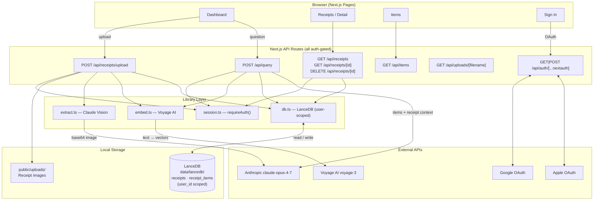

# Ledger.AI

A personal receipt scanning app. Snap a receipt, AI extracts everything, query your purchase history in natural language.

## Architecture



### Upload flow
`image` → save to disk → **Claude Vision** extracts structured JSON → validates it's a receipt → deduplication check → **Voyage AI** embeds each item → **LanceDB** stores receipt + items scoped to `user_id`

### Query (RAG) flow
`question` → **Voyage AI** embeds query → **LanceDB** vector search (filtered by `user_id`) → fetch parent receipts → **Claude** answers with full context

---

## Features

- **Authentication** — Google and Apple OAuth via NextAuth; invite-only mode via email allowlist
- **Scan receipts** — upload or snap a receipt; Claude extracts store, items, tax, payment, rewards, POS details
- **Non-receipt rejection** — non-receipt images are rejected before any data is stored
- **Duplicate detection** — same store + date + total is rejected with a redirect to the existing receipt
- **Dashboard** — monthly spend, category breakdown, recent receipts, AI query
- **Receipts** — browse and delete all scanned receipts
- **Items** — search and filter individual line items across all receipts
- **User-scoped data** — all receipts and items are isolated per user account

## Tech Stack

- [Next.js 16](https://nextjs.org) — frontend and API routes (App Router)
- [NextAuth.js v5](https://authjs.dev) — Google and Apple OAuth
- [Claude](https://anthropic.com) (`claude-opus-4-7`) — receipt extraction and natural language queries
- [LanceDB](https://lancedb.com) — embedded vector database (local, `data/lancedb/`)
- [Voyage AI](https://voyageai.com) (`voyage-3`) — semantic embeddings for vector search

## Prerequisites

- Node.js 18+
- [Anthropic API key](https://console.anthropic.com)
- [Voyage AI API key](https://dash.voyageai.com)
- Google OAuth credentials — [console.cloud.google.com](https://console.cloud.google.com) → APIs & Services → Credentials → OAuth 2.0 Client

## Setup

1. **Clone and install**

   ```bash
   git clone https://github.com/tapan-d/Receipt-AI.git
   cd Receipt-AI
   npm install
   ```

   > LanceDB ships native binaries. On some platforms you may need to install the platform package explicitly:
   > ```bash
   > npm install @lancedb/lancedb-darwin-arm64  # macOS Apple Silicon
   > npm install @lancedb/lancedb-darwin-x64    # macOS Intel
   > npm install @lancedb/lancedb-linux-x64-gnu # Linux x64
   > ```

2. **Configure environment**

   ```bash
   cp .env.local.example .env.local
   ```

   Edit `.env.local`:

   ```bash
   # AI APIs
   ANTHROPIC_API_KEY=sk-ant-...
   VOYAGE_API_KEY=pa-...

   # Auth (generate secret: openssl rand -hex 32)
   AUTH_SECRET=your-random-secret

   # Google OAuth — add http://localhost:3000/api/auth/callback/google
   # as an authorized redirect URI in Google Cloud Console
   AUTH_GOOGLE_ID=your-client-id.apps.googleusercontent.com
   AUTH_GOOGLE_SECRET=your-client-secret

   # Invite-only allowlist (remove this var entirely to open access)
   ALLOWED_EMAILS=you@example.com,friend@example.com
   ```

3. **Start the dev server**

   ```bash
   npm run dev
   ```

   Open [http://localhost:3000](http://localhost:3000).

## Data Storage

All data is stored locally — nothing sent to external servers except Anthropic and Voyage AI API calls.

| Location | Contents |
|---|---|
| `data/lancedb/` | Receipt records and vector embeddings (user-scoped) |
| `public/uploads/` | Uploaded receipt images |

Both directories are excluded from git.

## Usage

1. Sign in with Google (or Apple once configured)
2. Upload a receipt from the dashboard — drag-and-drop, file picker, or the camera FAB
3. Claude extracts all details in a few seconds; non-receipts are rejected automatically
4. Browse receipts under **Receipts**, individual items under **Items**
5. Ask anything in the dashboard query box — "How much did I spend on dairy this month?"

### Example questions

- How much did I spend on dairy products this month?
- Show me the price history of olive oil from Costco.
- What are my top 5 most purchased items?
- How much tax did I pay at Trader Joe's?
- Total spent on groceries last quarter?
