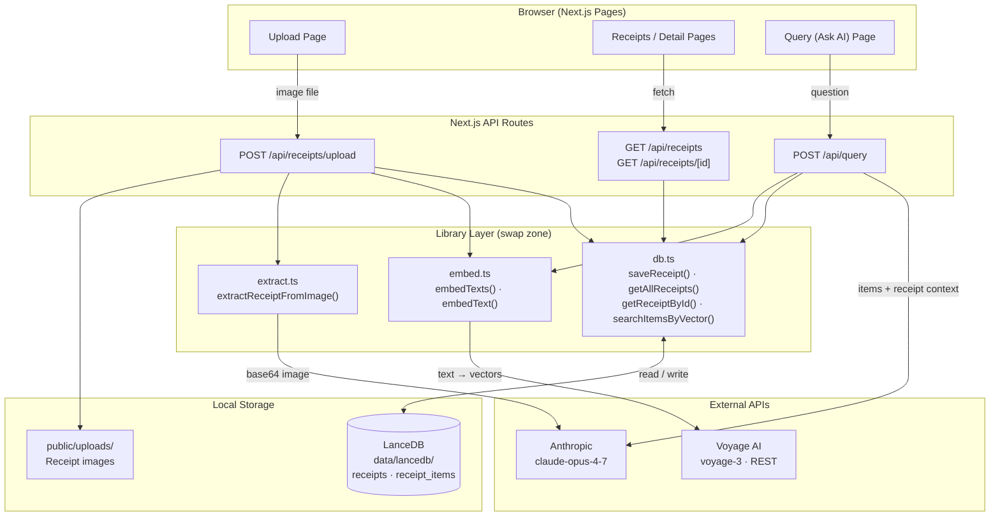

# Receipt AI

A personal receipt scanning app that uses Claude Vision to extract structured data from receipt images, stores it in a local vector database, and lets you query your purchase history in natural language.

## Architecture



### Upload flow
`image` → save to disk → **Claude Vision** extracts structured JSON → **Voyage AI** embeds each item → **LanceDB** stores receipt + item records with vectors

### Query (RAG) flow
`question` → **Voyage AI** embeds query → **LanceDB** vector search returns top-N items → fetch parent receipt records for tax/financial context → **Claude** answers with full context

---

## Features

- **Scan receipts** — upload or photograph a receipt; Claude extracts store info, items, tax, payment, rewards, and POS details automatically
- **Browse receipts** — view all scanned receipts and their line items with category tags
- **Ask AI** — query your purchase history in plain English (e.g. "How much did I spend on dairy this month?" or "Show me olive oil price history from Costco")

## Tech Stack

- [Next.js 15](https://nextjs.org) — frontend and API routes
- [Claude](https://anthropic.com) (`claude-opus-4-7`) — receipt image extraction and natural language answers
- [LanceDB](https://lancedb.com) — embedded vector database (no server required, data lives in `data/lancedb/`)
- [Voyage AI](https://voyageai.com) (`voyage-3`) — semantic embeddings for vector search

## Prerequisites

- Node.js 18+
- An [Anthropic API key](https://console.anthropic.com)
- A [Voyage AI API key](https://dash.voyageai.com)

## Setup

1. **Clone the repo**

   ```bash
   git clone https://github.com/tapan-d/Receipt-AI.git
   cd Receipt-AI
   ```

2. **Install dependencies**

   ```bash
   npm install
   npm install @lancedb/lancedb-darwin-x64   # macOS Intel
   # or
   npm install @lancedb/lancedb-darwin-arm64  # macOS Apple Silicon
   # or
   npm install @lancedb/lancedb-linux-x64-gnu # Linux x64
   ```

   > LanceDB ships native binaries as optional dependencies. Due to a [known npm bug](https://github.com/npm/cli/issues/4828), the platform-specific package sometimes needs to be installed explicitly.

3. **Add API keys**

   ```bash
   cp .env.local.example .env.local
   ```

   Edit `.env.local` and fill in your keys:

   ```
   ANTHROPIC_API_KEY=your_anthropic_api_key_here
   VOYAGE_API_KEY=your_voyage_api_key_here
   ```

4. **Start the development server**

   ```bash
   node node_modules/next/dist/bin/next dev
   ```

   Open [http://localhost:3000](http://localhost:3000).

## Data Storage

All data is stored locally on your machine — nothing is sent to external servers except the API calls to Anthropic and Voyage AI.

| Location | Contents |
|---|---|
| `data/lancedb/` | Receipt records and vector embeddings |
| `public/uploads/` | Uploaded receipt images |

Both directories are excluded from git. Data persists across restarts.

## Usage

1. Go to **Upload** and drop in a receipt image (JPG, PNG, or WebP)
2. Claude extracts all details — takes a few seconds
3. View the receipt under **Receipts** to verify the extracted data
4. Head to **Ask AI** to query across all your receipts in natural language

### Example questions

- How much did I spend on dairy products this month?
- Show me the price history of olive oil from Costco.
- What are my top 5 most purchased items?
- How much tax did I pay at Trader Joe's?
- Total spent on groceries last quarter?
